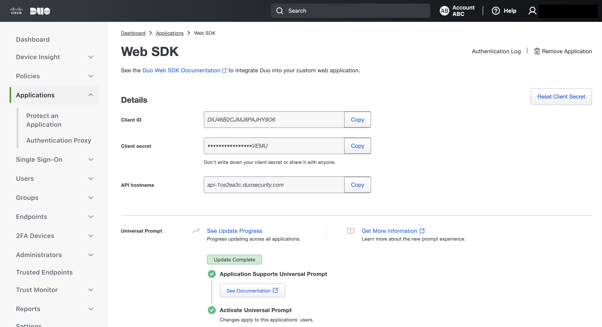
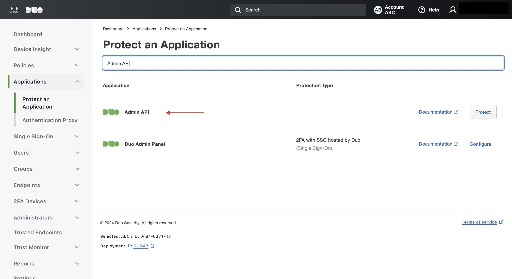
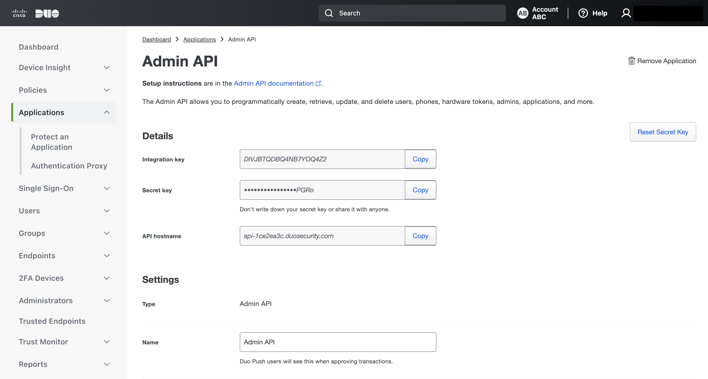
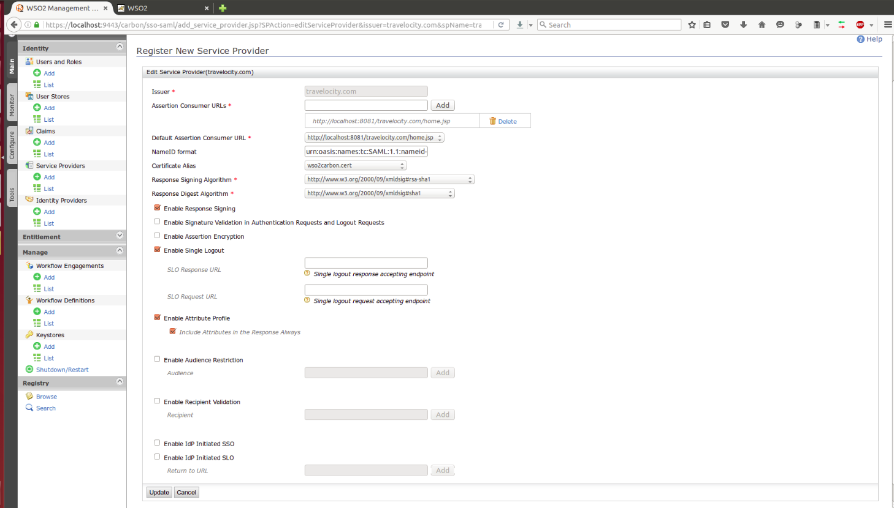
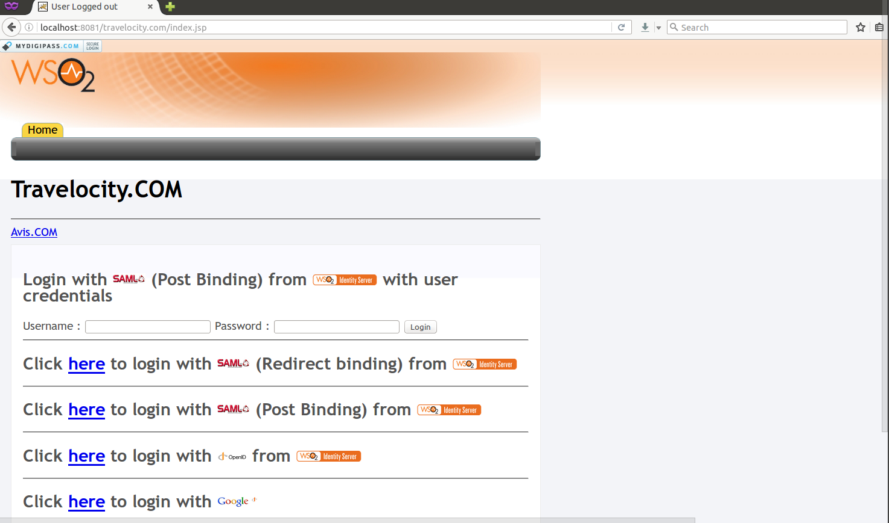
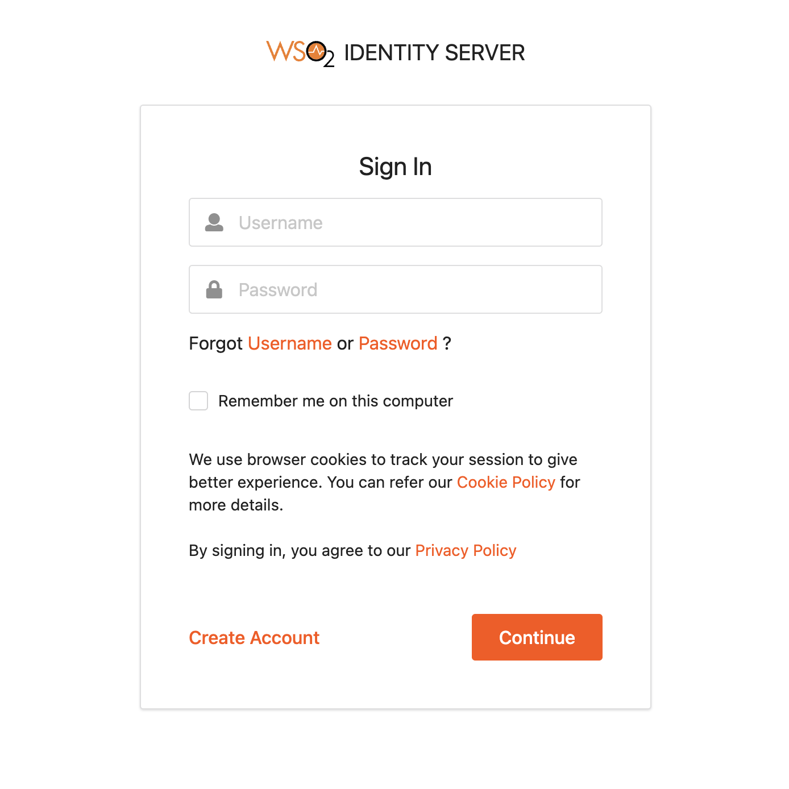

# Configuring Duo Security Authenticator

This topic provides instructions on how to configure the Duo Security app and the Identity Server. A sample app is used to demonstrate this integration. See the following sections for more information.
 ````
This is tested for the Duo Security API version V2.
 ````
 See the following sections for more information.

* [Configuring the Duo Security app](#configuring-the-duo-security-app)
* [Deploying Duo Security artifacts](#deploying-duo-security-artifacts)
* [Deploying travelocity.com sample app](#deploying-travelocitycom-sample-app)
* [Configuring the identity provider](#configuring-the-identity-provider)
* [Configuring the service provider](#configuring-the-service-provider)
* [Testing the sample](#testing-the-sample)

### Configuring the Duo Security app
1. Go to [https://duo.com](https://duo.com) and click free signup and register.
2. Log in to Duo Security. Click **Applications** from the left panel and then click the **Protect an Application** button.

    
3. In the **Protect an Application**  page, select **Auth API** from the list. **Auth API** credentials are **mandatory**.

    
4. Once the integration is created, you are given a **Secret key** and an **Integration key** for your integration. You can use these along with your Duo host when accessing Duo Security APIs.

    
5.  You can also configure the **Admin API** credentials if you need to validate the mobile numbers. When you verify the mobile number, use only these credentials. Navigate back to the **Protect an Application**  page and select  **Admin API**  from the list.  Once the Integration is created, you are given a **Secret key** and an **Integration key** for your integration.

    
 >> NOTE : If you can not see the type “Admin API” in the dropdown, contact the Duo team through support@duosecurity.com and ask for Admin API permission.

 When configuring the Admin API, select the Grant read resource permission.

 

 >> NOTE : This step is mandatory if you need to verify the user's mobile number in the user store with the mobile number in Duo Security. This is configured in step 4 of [Deploying Duo Security artifacts](#deploying-duo-security-artifacts).

### Deploying Duo Security artifacts
To download the authenticator and artifacts, go to the [WSO2 store](https://store.wso2.com/store/assets/isconnector/list?q=%22_default%22%3A%22duo%22).

 1. Place the duoauthenticationendpoint.war file into the <IS_HOME>/repository/deployment/server/webapps directory.
     
 2. Place the org.wso2.carbon.identity.authenticator.duo-1.x.x.jar file into the <IS_HOME>/repository/components/dropins directory.
    >> NOTE : If you want to upgrade the Duo Authenticator in your existing IS pack, please refer [upgrade instructions](https://docs.wso2.com/display/ISCONNECTORS/Upgrading+an+Authenticator).

 3. Place the [okio-1.9.0.jar](hhttps://search.maven.org/remote_content?g=com.squareup.okio&a=okio&v=1.9.0) into the <IS_HOME>/repository/components/lib directory.

    >> NOTE : You may have done this step already if you configured the [Duo Security Provisioning Connector](https://docs.wso2.com/display/ISCONNECTORS/Configuring+Duo+Security+Provisioning+Connector). If so, you can skip this step.

4. To enable the Duo Security authenticator, add the following configuration.
   
   *For 5.9.0 and later* add the following to the
   `<IS_HOME>/repository/conf/deployment.toml` file
    ```toml
    [authentication.authenticator.DuoAuthenticator]
    name="DuoAuthenticator"
    enable=true
    
5. Optionally, to verify the user store user's mobile number with the same user's mobile number in Duo Security, add the configuration as following,
   
   *For 5.9.0 and later* add the following to the `<IS_HOME>/repository/conf/deployment.toml` file  
    ```toml
    [authentication.authenticator.DuoAuthenticator.parameters]
    EnableMobileVerification=true
    ```
   
    This verification only requires the Admin API credentials that we
    will later configure.

6.  Optionally, if Duo authenticator is configured as the second factor in multi-factor authentication where a federated identity provider is configured as the first step, the following properties should be configured,

    *For 5.9.0 and later* add the following to the `<IS_HOME>/repository/conf/deployment.toml` file, 
    ```toml
    [authentication.authenticator.DuoAuthenticator.parameters]
    usecase="association"
    sendDuoToFederatedMobileAttribute=true
    federatedMobileNumberAttributeKey="http://wso2.org/claims/mobile"
    secondaryUserstore="primary"
    ```

- `sendDuoToFederatedMobileAttribute` - This specifies whether the mobile number claim should be taken from the claims provided by the Identity Provider.
- `federatedMobileNumberAttributeKey` - This specifies the value of the mobile claim provided by the Identity Provider. This property must be configured if the `useFederatedMobileClaim` is `true`.
- `usecase` - This field can take one of the following values: local, association, userAttribute, subjectUri. If you do not specify any usecase, the default value is local.
- `secondaryUserstore` - The user store configuration is maintained per tenant as comma separated values. For example, <Parameter name="secondaryUserstore">jdbc, abc, and xyz</Parameter>.

    The usecase value can be `local`, `association`,
    `             userAttribute            ` or
    `             subjectUri            ` .

    <table>
    <tbody>
    <tr class="odd">
    <td><code>                 local                </code></td>
    <td><p>This is based on the federated username. This is the default value. You must set the federated username in the localuserstore. Basically, the federated username must be the same as the local username.</p></td>
    </tr>
    <tr class="even">
    <td><code>                 association                </code></td>
    <td><p>The federated username must be associated with the local account in advance in the Dashboard. So the local username is retrieved from the association. To associate the user, log into the <a href="../../learn/using-the-end-user-dashboard">end user dashboard</a> and go to <strong>Associated Account</strong> by clicking <strong>View details</strong> .</p></td>
    </tr>
    <tr class="odd">
    <td><code>                 userAttribute                </code></td>
    <td><div class="content-wrapper">
    <p>The name of the  federatedauthenticator's user attribute. That is,the local user namewhich is contained in a federated user's attribute. When using this, add the following parameter under the <code>                   authentication.authenticator.DuoAuthenticator                  </code> section in the <code>                   &lt;IS_HOME&gt;/repository/conf/deployment.toml                  </code> file and put the value (e.g., email, screen_name, id, etc.).</p>
    <div class="code panel pdl" style="border-width: 1px;">
    <div class="codeContent panelContent pdl">
    <div class="sourceCode" id="cb1" data-syntaxhighlighter-params="brush: xml; gutter: false; theme: Confluence" data-theme="Confluence" style="brush: xml; gutter: false; theme: Confluence"><pre class="sourceCode xml"><code class="sourceCode xml"><a class="sourceLine" id="cb1-1" title="1"><p class="kw">[authentication.authenticator.DuoAuthenticator]</p><span class="st">userAttribute</span><span class="kw">&#61;</span>&quot;mobile&quot;</a></code></pre></div>
    </div>
    </div>
    <p>If you use, OpenID Connect supported authenticators such as LinkedIn, Foursquare, etc., or in the case of multiple social login options as the first step and Duo as second step, you need to add similar configuration for the specific authenticator in the <code>                   &lt;IS_HOME&gt;/repository/conf/deployment.toml </code> file under the corresponding authenticator's configuration section section as follows (the following shows the configuration for Facebook and Foursquare  authenticator respectively).</p>
    <p><b>Facebook</b></p>
          <div class="sourceCode" id="cb1" data-syntaxhighlighter-params="brush: xml; gutter: false; theme: Confluence" data-theme="Confluence" style="brush: xml; gutter: false; theme: Confluence"><pre class="sourceCode xml"><code class="sourceCode xml"><a class="sourceLine" id="cb1-1" title="1"><span class="kw">                
     [authentication.authenticator.facebook.parameters]
     EmailOTP-userAttribute = "mobile"
     federatedEmailAttributeKey = "mobile"
         </span></a></code></pre></div>                    
     <p><b>Foursquare</b></p>
          <div class="sourceCode" id="cb1" data-syntaxhighlighter-params="brush: xml; gutter: false; theme: Confluence" data-theme="Confluence" style="brush: xml; gutter: false; theme: Confluence"><pre class="sourceCode xml"><code class="sourceCode xml"><a class="sourceLine" id="cb1-1" title="1"><span class="kw">               
     [[authentication.custom_authenticator]]
     name= "Foursquare"
     [authentication.custom_authenticator.parameters]
     EmailOTP-userAttribute = "http://wso2.org/foursquare/claims/mobile"
     federatedEmailAttributeKey = "http://wso2.org/foursquare/claims/mobile"
      </span></a></code></pre></div>                               
    <p>Likewise, you can add the AuthenticatorConfig for Amazon, Google, Twitterand Instagram with relevant values.</p>
    </div></td>
    </tr>
    <tr class="even">
    <td><code>                 subjectUri                </code></td>
    <td><p>When configuring the federated authenticator, select the attribute in the subject identifier under the service provider section in UI, this is used as the username of the Duo authenticator.</p></td>
    </tr>
    </tbody>
    </table>
    
    ```
    Duo Security mainly uses Mobile Phone two-factor authentication to ensure secure login.
    ```
   >> NOTE : When you update the mobile claim in user profile , use the same format of mobile number with country code as you registered in the DUO site. (i.e +9477*******)

### Deploying travelocity.com sample app
    
   The next step is to deploy the travelocity.com sample app in order to use it in this scenario.
   To do this, see the topic on [deploying the travelocity.com sample app](https://docs.wso2.com/display/ISCONNECTORS/Deploying+the+Sample+App).

### Configuring the identity provider
Now you have to configure WSO2 Identity Server by adding a [new identity provider](https://docs.wso2.com/display/IS530/Adding+and+Configuring+an+Identity+Provider).
 1. Download the WSO2 Identity Server from [here](https://wso2.com/identity-and-access-management).
 2. Run the [WSO2 Identity Server](https://docs.wso2.com/display/IS530/Running+the+Product).
 3. Log in to the [management console](https://docs.wso2.com/display/IS530/Getting+Started+with+the+Management+Console) as an administrator.
 4. In the **Identity Providers** section under the **Main** tab of the management console, click **Add**.
 5. Give a suitable name for **Identity Provider Name**.
 6. Go to **Duo Configuration** under **Federated Authenticators**.

    
 7. Enter the values as given in the above figure.
    * **Host:** Host of Duo API.
    * **Integration Key:** Integration Key of Auth API.
    * **Secret Key:**  Secret Key of Auth API.
    * **Admin Integration Key:** Integration Key of Admin API (Optional Configuration).
    * **Admin Secret Key:** Secret Key of Admin API (Optional Configuration).
    * **Disable User Store Domain:** Configured as true if you wanted to strip off the user store domain from username.
    * **Disable Tenant Domain:** Configured as true if you wanted to strip off the tenant domain from username.
    >> NOTE :  Disable User Store Domain and Disable Tenant Domain are optional configurations, If you want to strip off both user store domain and tenant domain from user name then configured both as true.
 8. Select both check-boxes to **Enable** the Duo Authenticator and make it the **Default**.
 9. Click **Register**.

You have now added the identity provider.

### Configuring the service provider
The next step is to configure the service provider.
 1. Return to the management console.
 2. In the **Service Providers** section, click **Add** under the **Main** tab.
 3. Since you are using travelocity as the sample, enter [travelocity.com](https://www.travelocity.com/) in the **Service Provider Name** text box and click **Register**.
 4. In the **Inbound Authentication Configuration** section, click **Configure** under the **SAML2 Web SSO Configuration** section.

    
 5. Now set the configuration as follows:
    * **Issuer:** travelocity.com
    * **Assertion Consumer URL:**  http://localhost:8081/travelocity.com/home.jsp
 6. Select the following check-boxes:
    * **Enable Response Signing**.
    * **Enable Single Logout**.
    * **Enable Attribute Profile**.
    * **Include Attributes in the Response Always**.

        
 7. Click **Update** to save the changes. Now you will be sent back to the **Service Providers** page.
 8. Navigate to the **Local and Outbound Authentication Configuration** section.
 9. Select the **Advanced Configuration** radio button option.

    
 10. Add the basic authentication as the first step and Duo authentication as the second step and click **Update** to save the changes.

     

You have now added and configured the service provider.

### Testing the sample
 
1.  To test the sample, go to the following URL:
    http://<TOMCAT_HOST>:<TOMCAT_PORT>/travelocity.com/index.jsp . E.g.,
    http://localhost:8080/travelocity.com . Login with to
    travelocity.com via the WSO2 Identity Server.

    
 3. The basic authentication page appears. Log in using your username and password.

    
 4. You are directed to the Duo Security authentication page.

    
    
> >    NOTE : If you haven't installed the Duo app in your mobile, you
> >    will be guided to install and set-up the application at this
> >    step. 

 5. If your verification is successful, you are taken to the home page of the travelocity.com app.

    
